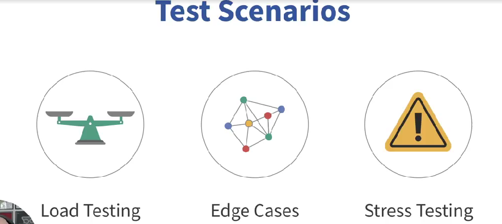

# ISTQB_Foundation

---

## What is ISTQB Certification?
- **ISTQB** (International Software Testing Qualifications Board) offers globally recognized certifications in software testing.
- **Foundation Level** is the entry-level certification, focusing on **core testing principles** and **best practices**.

---
## Key Benefits of ISTQB Certification
- **For Entry-Level QA**:
  - Provides a **strong theoretical foundation** in software testing.
  - Helps you stand out in job applications, especially if you lack hands-on experience.
  - Shows employers that you understand **standard testing practices**.

  # What is Testing? - Quick Revision Notes

This section summarizes the **key concepts** of software testing, focusing on what testing is and why it’s important.

---

## Definition of Testing
- **Testing** is the process of evaluating a system or its components to verify that it meets **specified requirements**.

- It ensures the software:
  - Does what it’s supposed to do.
  - Meets user expectations.
  - Functions correctly under intended conditions.

---

## Key Objectives of Testing
1. **Find Defects**: Identify bugs or issues in the software.
2. **Ensure Quality**: Verify that the software meets quality standards.
3. **Reduce Risk**: Prevent issues from reaching users.
4. **Validate Requirements**: Ensure the software meets agreed-upon requirements.

---

## Testing vs. Debugging
- **Testing**:
  - Focuses on **finding defects**.
  - Involves executing tests (manual or automated) to evaluate the software.
  - A **preventative measure** to reduce risks before release.

- **Debugging**:
  - Focuses on **fixing defects** found during testing.
  - Done by developers to resolve issues in the code.

---

# Why is Testing Necessary? - Quick Revision Notes

This section explains why testing is crucial in software development and its role in ensuring software quality.

---

## Why is Testing Necessary?
1. **Prevent Costly Defects**:
   - Testing identifies issues before they reach users, avoiding expensive fixes and system failures.

2. **Ensure Software Quality**:
   - Testing verifies that the software meets **functional**, **security**, and **reliability** standards.

3. **Improve User Experience**:
   - Testing ensures the software works as intended, providing a smooth and reliable experience for users.

4. **Mitigate Risks**:
   - Testing acts as a **preventative measure** to reduce risks like security breaches, data loss, or system crashes.

---

## Testing vs. Quality Assurance (QA)
- **Quality Assurance (QA)**:
  - A **broader process** that ensures high standards throughout the software development lifecycle (SDLC).
  
- **Testing**:
  - A **specific activity** within QA that evaluates the product to ensure it meets quality benchmarks.

---

## Key Terms in Testing
- **Root Cause**: The underlying reason for a defect.
- **Error**: A mistake made by a developer during coding.
- **Defect**: A flaw in the software caused by an error.
- **Failure**: When the system does not work as expected due to a defect.

---

## How Testing Works
1. **Identify Errors**: Developers make mistakes (errors) during coding.
2. **Detect Defects**: Testing reveals flaws (defects) in the software caused by errors.
3. **Prevent Failures**: Fixing defects ensures the system works as expected, avoiding failures.

---

## Key Takeaways for Interviews
- **Testing is necessary** to ensure software is **functional**, **secure**, and **reliable**.
- It prevents costly defects, system failures, and poor user experiences.
- Testing is a **preventative measure** that mitigates risks before software reaches users.
- Understand the difference between **root cause**, **error**, **defect**, and **failure**.

---# Testing Principles - Quick Revision Notes

This section covers the **7 fundamental testing principles** that guide effective software testing.

---

## The 7 Testing Principles
1. **Testing Shows the Presence of Defects**:
   - Testing helps find bugs, but it **cannot prove** that the software is completely bug-free.
   - Focus: Uncover defects, not prove perfection.

2. **Exhaustive Testing is Impossible**:
   - It’s impractical to test every possible scenario.
   - Focus on **high-risk areas** and **priority features**.

3. **Early Testing Saves Time and Money**:
   - Defects found early in the development process are **cheaper and easier** to fix.
   - Example: Fixing a small leak before it becomes a flood.

4. **Defects Cluster Together**:
   - Most bugs are concentrated in a **few parts** of the system.
   - Focus testing efforts on areas with the **highest defect density**.

5. **Pesticide Paradox**:
   - Repeated use of the same tests makes them **less effective** at finding new bugs.
   - Regularly **review and update** test cases to keep them effective.

6. **Testing is Context-Dependent**:
   - Testing approaches vary based on the **type of software**.
   - Example: Testing an e-commerce website is different from testing a medical device.

7. **Absence of Errors is a Fallacy**:
   - Even if no defects are found, the software may still fail to meet **user needs**.
   - Focus: Ensure the software is **useful** and meets requirements, not just bug-free.

---

## Key Takeaways for Interviews
- Testing principles help focus on **finding important bugs early** and **adapting to the project context**.
- Understand and explain the **7 principles** in your own words.
- Emphasize the importance of **early testing**, **risk-based testing**, and **user-centric testing**.

---

# Test Activities, Testware, and Test Roles - Quick Revision Notes

This section explains the **key activities**, **testware**, and **roles** involved in the software testing process.

---

## Test Activities
1. **Test Planning**:
   - Define **goals**, **scope**, and **resources** for testing.
   - Create a roadmap to guide the testing process.

2. **Test Analysis and Design**:
   - Determine **what to test** and **how to test**.
   - Create test cases and design test scenarios.

3. **Test Implementation and Execution**:
   - Execute test cases and scripts.
   - Identify and report defects.

4. **Test Monitoring and Control**:
   - Track progress (e.g., schedule, defect count).
   - Adjust testing efforts to stay on track.

5. **Test Completion**:
   - Wrap up testing activities.
   - Document results and ensure testing goals are met.
   - Maintain **traceability** (linking tests to requirements/defects).

---

## Testware
- **Definition**: All artifacts used in testing, including:
  - Test cases
  - Test scripts
  - Test data
  - Test plans
- **Purpose**: Ensures consistency and smooth execution of testing activities.

---

## Test Roles
1. **Testing Role**:
   - Focuses on the **engineering aspect** of testing.
   - Responsibilities:
     - Test analysis and design.
     - Test implementation and execution.

2. **Test Management Role**:
   - Focuses on the **process aspect** of testing.
   - Responsibilities:
     - Test planning.
     - Test monitoring and control.
     - Test completion.

- **Note**: In Agile teams, these roles may overlap, and responsibilities are often shared collaboratively.

---

## Context in Testing
- **Impact of Context**:
  - Testing strategies vary based on the **type of software** (e.g., mobile app vs. web app).
  - Adapt testing methods to fit the **project context**.

---

## Traceability
- **Definition**: Linking every test to a **requirement** or **defect**.
- **Importance**:
  - Ensures **complete coverage** of requirements.
  - Prevents issues from slipping through the cracks.

---

## Key Takeaways for Interviews
- Testing is a **structured process** with **planned activities**.
- **Testware** supports testing by providing necessary artifacts.
- Understand the **testing role** (engineering focus) vs. **test management role** (process focus).
- Adapt testing strategies based on **project context**.
- Maintain **traceability** to ensure all requirements are tested.

---
# Essential Skills and Good Practices in Testing - Quick Revision Notes

This section covers the **key skills** and **best practices** that make a great software tester.

---

## Essential Skills for Testers
1. **Attention to Detail**:
   - Ability to spot **small issues** that others might overlook.
   - Bugs can hide in unexpected places, so a sharp eye is critical.

2. **Communication**:
   - Clearly explain defects and testing processes to **both technical and non-technical teams**.
   - Act as a bridge between **development** and **end-users**.

3. **Critical Thinking**:
   - Challenge assumptions and think **outside the box**.
   - Ask questions to uncover **hidden issues** that aren’t immediately visible.

---

## Good Practices in Testing
1. **Whole Team Approach**:
   - Quality is a **team effort**, not just the responsibility of testers.
   - Developers, testers, and business analysts should **collaborate** throughout the development process.
   - Ensures testing is integrated into **every phase** of development, not just the end.

2. **Independent Testing**:
   - **Benefits**:
     - A **fresh perspective** from someone not involved in development can catch issues others might miss.
   - **Drawbacks**:
     - Complete independence can distance testers from **valuable team insights**.
   - **Balance**: Use a mix of **team collaboration** and **independent testing** for the best results.

---

## Key Takeaways for Interviews
- **Attention to detail**, **communication**, and **critical thinking** are essential skills for testers.
- The **whole team approach** ensures quality is everyone’s responsibility.
- **Independent testing** brings a fresh perspective but should be balanced with team collaboration.
- Testing should be integrated throughout the **entire development process**, not just at the end.

---

> **Note**: A great tester combines **technical knowledge** with **soft skills** and follows **best practices** to ensure high-quality software.

# Testing in the Context of SDLC - Quick Revision Notes

This section explains how testing fits into different **software development lifecycles (SDLC)** and the importance of adapting testing practices to each model.

---

## Software Development Lifecycle (SDLC)
- **Definition**: The stages a project goes through from **idea to deployment**.
- **Testing is integrated throughout the SDLC**, not just at the end.

---

## Testing in Different SDLC Models
1. **Waterfall Model**:
   - Testing is typically done **towards the end** of the development process.
   - **Drawback**: Bugs found late can be costly to fix.

2. **Agile Model**:
   - Testing is **continuous** and integrated into **every sprint**.
   - **Benefit**: Bugs are found and fixed early, reducing costs.

3. **DevOps**:
   - Testing is **automated**, **continuous**, and part of the **deployment pipeline**.
   - **Focus**: Test every step of the process, not just at the end.

---

## Good Testing Practices Across All SDLCs
- **Test Early**: Find and fix defects as early as possible.
- **Automate Repetitive Tasks**: Save time and ensure consistency.
- **Maintain Clear Documentation**: Ensure traceability and clarity.

---

## Test-First Approaches
1. **Test-Driven Development (TDD)**:
   - Write **tests before writing code**.
   - Ensures code meets requirements from the start.

2. **Behavior-Driven Development (BDD)**:
   - Focus on **behavior** using tests to describe how the software should behave.
   - Encourages collaboration between developers, testers, and business stakeholders.

---

## Shift-Left Testing
- **Definition**: Moving testing **earlier** in the development process.
- **Benefit**: Find and fix defects sooner, reducing **cost** and **effort** later.
- **Goal**: Prevent issues before they become major problems.

---

## Retrospectives
- **Definition**: Regular reviews to **evaluate the process** and identify areas for improvement.
- **Used in Agile and DevOps**:
  - Teams reflect on what worked and what didn’t.
  - Continuously improve testing practices for better results.

---

## Key Takeaways for Interviews
- Testing must **adapt** to the chosen SDLC (Waterfall, Agile, DevOps).
- **Test early**, **automate repetitive tasks**, and **maintain documentation** are universal best practices.
- **Test-first approaches** (TDD, BDD) ensure testing is built into the development process.
- **Shift-left testing** helps find defects early, reducing costs.
- **Retrospectives** are used to continuously improve testing practices.

---

> **Note**: Testing is a **continuous process** that evolves with the SDLC to ensure high-quality software delivery.

# Test Levels and Test Types - Quick Revision Notes

This section explains the **different levels** and **types of testing** used in software development.

---

## Test Levels
1. **Unit Testing**:
   - Tests **individual components** or functions.
   - Ensures each unit works as expected.

2. **Integration Testing**:
   - Tests **interactions between integrated components**.
   - Ensures different parts of the system work well together.

3. **System Testing**:
   - Tests the **entire system** as a whole.
   - Ensures the system meets **functional and non-functional requirements**.

4. **Acceptance Testing**:
   - Tests whether the software meets **end-user needs**.
   - Includes **User Acceptance Testing (UAT)**.

---

## Test Types
1. **Functional Testing**:
   - Tests **what the system does** (e.g., features, functionality).

2. **Non-Functional Testing**:
   - Tests **how the system performs** (e.g., performance, security, usability).

3. **Structural Testing**:
   - Tests the **internal structure or code** of the system.

4. **Change-Related Testing**:
   - Ensures changes don’t break the system.
   - Includes:
     - **Confirmation Testing**: Checks if a specific defect has been fixed.
     - **Regression Testing**: Checks if changes have caused new defects in other parts of the system.

---

## Confirmation Testing vs. Regression Testing
- **Confirmation Testing**:
  - Focuses on **verifying a specific fix** for a defect.
  - Example: If Test Case 1 failed in the first execution, running it again after the fix is confirmation testing.

- **Regression Testing**:
  - Focuses on **ensuring changes haven’t introduced new defects**.
  - Example: If Test Case 2 passed in the first execution, running it again after changes is regression testing.

---

## Key Takeaways for Interviews
- **Test Levels**: Unit, Integration, System, Acceptance.
- **Test Types**: Functional, Non-Functional, Structural, Change-Related.
- **Confirmation Testing**: Verifies a specific fix.
- **Regression Testing**: Ensures changes haven’t broken other parts of the system.
- **Focus**: Understand the difference between **test levels** and **test types**, and how **confirmation** and **regression testing** work.

---

> **Note**: Testing is divided into **levels** (stages of testing) and **types** (nature of tests), each serving a specific purpose in ensuring software quality.

# Maintenance Testing - Quick Revision Notes

This section explains what **maintenance testing** is, its **triggers**, and its **key objectives**.

---

## What is Maintenance Testing?
- **Definition**: Testing performed on software systems **already in production** after changes or updates are introduced.
- **Purpose**: Ensures that changes (e.g., bug fixes, new features, updates) do not **break existing functionality**.

---

## Triggers for Maintenance Testing
1. **Bug Fixes**: Testing to ensure the fix works and doesn’t introduce new issues.
2. **Patches**: Testing updates or patches applied to the system.
3. **New Features**: Testing new functionality added to the software.
4. **Performance Improvements**: Testing changes aimed at optimizing performance.
5. **Security Updates**: Testing updates to address security vulnerabilities.

---

## Key Objectives of Maintenance Testing
1. **Verify Changes**:
   - Ensure that recent changes (e.g., bug fixes, updates) do not **negatively affect existing functionality**.
   - Example: Fixing one bug shouldn’t introduce two more.

2. **Ensure User Needs are Met**:
   - Confirm that the software still meets **user needs** after modifications.
   - Example: Updates should align with the intended **user experience**.

3. **Prevent Disruptions**:
   - Avoid scenarios where updates cause **system crashes** or **performance issues**.
   - Example: A performance enhancement shouldn’t cause the app to crash under high loads.

4. **Maintain User Trust**:
   - Prevent loss of functionality and ensure a **smooth user experience**.
   - Example: Avoid user frustration caused by disruptions after updates.

---

## Key Takeaways for Interviews
- **Maintenance testing** is performed on **live systems** after changes are introduced.
- **Triggers**: Bug fixes, patches, new features, performance improvements, security updates.
- **Objectives**:
  - Verify changes don’t break existing functionality.
  - Ensure the software still meets user needs.
  - Prevent disruptions and maintain user trust.

---

> **Note**: Maintenance testing is like a **regular health check** for software, ensuring it continues to function correctly after updates or changes.

# Static Testing Basics - Quick Revision Notes

This section explains what **static testing** is, its **value**, and how it differs from **dynamic testing**.

---

## What is Static Testing?
- **Definition**: A method of testing **without executing the code**.
- **Purpose**: Finds defects in **work products** (e.g., requirements, design documents, code) by examining them.
- **Examples**:
  - Reviewing code for **coding standards**.
  - Reviewing design documents to ensure they meet **project needs**.

---

## Value of Static Testing
1. **Early Defect Detection**:
   - Catches errors **early** in the development process.
   - Example: Finding a mistake in a requirements document is **cheaper** than fixing it during testing or after release.

2. **Cost and Time Savings**:
   - Reduces the need for **rework** later in the development lifecycle.
   - Saves **time** and **resources**.

3. **Improved Communication**:
   - Helps identify **logical errors** and **miscommunication** in documents.

---

## Work Products for Static Testing
- **Requirements Documents**
- **Design Documents**
- **Source Code**
- **Test Plans**
- **User Manuals**

---

## Static Testing vs. Dynamic Testing
| **Aspect**            | **Static Testing**                          | **Dynamic Testing**                        |
|------------------------|---------------------------------------------|--------------------------------------------|
| **Execution**          | No code execution.                         | Code is executed.                          |
| **Focus**              | Examines **work products** (e.g., documents, code). | Tests **software behavior** during runtime. |
| **Examples**           | Code reviews, design document reviews.      | Functional testing, performance testing.   |

---

## Key Takeaways for Interviews
- **Static testing** is performed **without executing the code**.
- It helps catch defects **early**, saving time and costs.
- **Work products** include requirements, design documents, and source code.
- **Static testing** focuses on **logical errors** and **miscommunication**, while **dynamic testing** focuses on **software behavior**.

---

> **Note**: Static testing is like **proofreading** for software development, ensuring errors are caught before they become costly issues.

# Feedback and Review Process - Quick Revision Notes

This section explains the **feedback and review process** in software testing, its **benefits**, and the **types of reviews**.

---

## What is the Feedback and Review Process?
- **Definition**: A structured process to **evaluate work products** (e.g., requirements, code, design documents) and provide **early feedback**.
- **Purpose**: Identify defects **early**, minimize rework, and ensure the product meets requirements.

---

## Key Activities in the Review Process
1. **Planning**:
   - Define the scope, objectives, and participants for the review.

2. **Preparation**:
   - Reviewers examine the work product and prepare feedback.

3. **Conducting the Review**:
   - Hold a meeting or session to discuss findings and provide feedback.

4. **Follow-Up**:
   - Address and resolve issues identified during the review.

---

## Benefits of Reviews
1. **Early Defect Detection**:
   - Identify issues **before they become major problems**.

2. **Multiple Perspectives**:
   - Get input from **stakeholders** across the project to ensure all requirements are met.

3. **Improved Quality**:
   - Enhance the quality of work products before testing begins.

4. **Reduced Rework**:
   - Minimize the need for costly fixes later in the development process.

---

## Types of Reviews
1. **Informal Review**:
   - A **casual check** of the work product.
   - Examples: Code walkthroughs, pair reviews.

2. **Formal Review**:
   - A **structured approach** with defined roles and documentation.
   - Examples: Inspections, audits.

---

## Roles in the Review Process
1. **Moderator**:
   - Leads the review and ensures it stays on track.

2. **Scribe**:
   - Takes notes during the review.

3. **Reviewers**:
   - Provide feedback on the work product.

4. **Author**:
   - The creator of the work product being reviewed.

---

## Key Takeaways for Interviews
- The **feedback and review process** helps catch defects **early** and ensures the product meets requirements.
- **Types of reviews**: Informal (casual) vs. Formal (structured).
- **Roles**: Moderator, Scribe, Reviewers, Author.
- **Benefits**: Early defect detection, multiple perspectives, improved quality, reduced rework.

---

> **Note**: A well-planned and constructive review process adds **real value** to a project by improving the quality of work products before testing begins.

# Test Techniques Overview - Quick Revision Notes

This section provides an overview of the **three main categories of test techniques**: **Black Box**, **White Box**, and **Experience-Based Testing**.

---

## What are Test Techniques?
- **Definition**: Structured methods to **find defects** effectively.
- **Purpose**: Focus on areas where errors are likely and approach testing systematically.

---

## Categories of Test Techniques
1. **Black Box Testing**:
   - **Focus**: Tests **functionality** without knowledge of internal code.
   - **Approach**: Inputs and expected outputs (user perspective).
   - **Example**: Testing a login page to ensure it works correctly.

2. **White Box Testing**:
   - **Focus**: Tests **internal code structure** and logic.
   - **Approach**: Requires knowledge of the code.
   - **Example**: Testing algorithms or critical code paths.

3. **Experience-Based Testing**:
   - **Focus**: Relies on the tester’s **intuition**, **knowledge**, and **experience**.
   - **Approach**: Less structured, often used for **exploratory testing**.
   - **Example**: Testing areas prone to security vulnerabilities based on past experience.

---

## When to Use Each Technique
- **Black Box Testing**:
  - Ideal for **end-user functionality** (e.g., validating features).
  
- **White Box Testing**:
  - Used for **code-level validation** (e.g., algorithms, critical paths).

- **Experience-Based Testing**:
  - Useful for **exploratory testing** and identifying **common weak spots**.

---

## Key Takeaways for Interviews
- **Black Box Testing**: Focuses on **user functionality** without internal code knowledge.
- **White Box Testing**: Focuses on **internal code structure** and logic.
- **Experience-Based Testing**: Relies on the tester’s **expertise** to identify potential issues.
- **Combination**: Often, a mix of techniques is used to ensure **thorough testing** of both **internal mechanics** and **user functionality**.

---

> **Note**: Understanding and selecting the **right test technique** can significantly improve the quality of software by uncovering defects effectively.
# Black-Box Test Techniques - Quick Revision Notes

This section explains the **four key black-box testing techniques**: **Equivalence Partitioning**, **Boundary Value Analysis**, **Decision Table Testing**, and **State Transition Testing**.

---

## What is Black-Box Testing?
- **Definition**: Testing the **functionality** of software without knowledge of its internal code.
- **Focus**: Inputs and outputs (user perspective).
- **Goal**: Ensure the software meets **user expectations** and **requirements**.

---

## Black-Box Test Techniques
1. **Equivalence Partitioning**:
   - **Definition**: Group inputs that behave similarly into **partitions**.
   - **Example**: If a field accepts ages 18–65, test one value from the valid range (e.g., 30) and invalid ranges (e.g., 10, 70).
   - **Purpose**: Saves time by reducing the number of test cases.

2. **Boundary Value Analysis**:
   - **Definition**: Test values at the **edges** of input ranges.
   - **Example**: For ages 18–65, test values like 17, 18, 19, 64, 65, and 66.
   - **Purpose**: Catches errors at the boundaries where defects are most likely.

3. **Decision Table Testing**:
   - **Definition**: Test all possible **combinations of conditions** and their outcomes.
   - **Example**: A discount system based on age and membership status.
   - **Purpose**: Ensures all logical conditions are covered.

4. **State Transition Testing**:
   - **Definition**: Test how the system changes **states** based on events or user actions.
   - **Example**: A login system that locks after 3 failed attempts.
   - **Purpose**: Ensures the system behaves correctly during state changes.

---

## When to Use Each Technique
- **Equivalence Partitioning**: For testing **input ranges** efficiently.
- **Boundary Value Analysis**: For testing **edge cases** in input ranges.
- **Decision Table Testing**: For testing **complex logic** with multiple conditions.
- **State Transition Testing**: For testing **state-based systems** (e.g., login flows).

---

## Key Takeaways for Interviews
- **Black-box testing** focuses on **user functionality** without internal code knowledge.
- **Equivalence Partitioning**: Group inputs to reduce test cases.
- **Boundary Value Analysis**: Test edge values to catch boundary defects.
- **Decision Table Testing**: Cover all logical combinations of conditions.
- **State Transition Testing**: Test state changes in the system.

---

> **Note**: Black-box testing techniques provide a **user-centric approach** to uncover defects, ensuring the software behaves as expected for end-users.

# White-Box Test Techniques - Quick Revision Notes

This section explains **white-box testing**, its **techniques**, and its **benefits**.

---

## What is White-Box Testing?
- **Definition**: Testing the **internal structure** of the code.
- **Also Known As**: Structural or Clear Box Testing.
- **Focus**: Ensures that the code works as intended by examining **logic flows**, **decision points**, and **code paths**.
- **Goal**: Improve **code quality**, **reliability**, and **performance**.

---

## White-Box Test Techniques
1. **Statement Testing**:
   - **Definition**: Ensures that **every line of code** is executed at least once.
   - **Purpose**: Verifies that each statement works as expected and identifies **unused or unreachable code**.
   - **Example**: In a login program, test cases ensure that all lines (e.g., for valid and invalid inputs) are executed.

2. **Branch Testing**:
   - **Definition**: Tests **all decision points** in the code (e.g., `if-else`, `switch` conditions).
   - **Purpose**: Ensures that **every possible outcome** of a decision is tested.
   - **Example**: In a program with user access levels, test each access level to confirm correct behavior.

---

## Benefits of White-Box Testing
1. **Improved Code Quality**:
   - Identifies and fixes **logical errors** in the code.
   - Ensures **high code coverage**.

2. **Optimization**:
   - Helps identify **dead code** and areas for **performance improvement**.

3. **Early Defect Detection**:
   - Catches issues that might go unnoticed in **black-box testing**.

4. **Maintainability**:
   - Makes the software more **robust** and easier to maintain.

---

## Key Takeaways for Interviews
- **White-box testing** focuses on the **internal structure** of the code.
- **Statement Testing**: Ensures every line of code is executed.
- **Branch Testing**: Tests all decision points and outcomes.
- **Benefits**: Improves code quality, reliability, and performance.

---

> **Note**: White-box testing is essential for ensuring **high-quality code** by examining **logic flows** and **decision points** within the software.

# Experience-Based Test Techniques - Quick Revision Notes

This section explains the **three key experience-based testing techniques**: **Error Guessing**, **Exploratory Testing**, and **Checklist-Based Testing**.

---

## What are Experience-Based Test Techniques?
- **Definition**: Techniques that rely on the tester’s **intuition**, **experience**, and **domain knowledge** to uncover defects.
- **Purpose**: Identify issues that structured testing might miss, especially in **dynamic** or **time-constrained** environments.

---

## Experience-Based Test Techniques
1. **Error Guessing**:
   - **Definition**: Using **past experience** to predict where errors might occur.
   - **Example**: Testing areas prone to errors, such as date formats or user input fields.
   - **Purpose**: Quickly identify **common pitfalls** based on previous issues.

2. **Exploratory Testing**:
   - **Definition**: Testing without a predefined plan, exploring the application **freely**.
   - **Approach**: Combines **test design** and **execution** in real-time.
   - **Purpose**: Discover **unexpected issues** and adapt to **changing requirements**.
   - **Example**: Navigating through an app, trying out features as you go.

3. **Checklist-Based Testing**:
   - **Definition**: Using a **checklist** of key functionalities or risk areas to guide testing.
   - **Approach**: Structured but flexible, ensuring **critical areas** are covered.
   - **Example**: A checklist might include items like “Verify login validation” or “Check form submission.”
   - **Purpose**: Balance **efficiency** and **thoroughness**.

---

## When to Use Experience-Based Techniques
- **Error Guessing**: When you know **common problem areas** from past experience.
- **Exploratory Testing**: In **dynamic environments** with **changing requirements** or **limited documentation**.
- **Checklist-Based Testing**: When you need a **structured yet flexible** approach to ensure key areas are tested.

---

## Key Takeaways for Interviews
- **Error Guessing**: Predict errors based on **past experience**.
- **Exploratory Testing**: Freely explore the application to find **unexpected issues**.
- **Checklist-Based Testing**: Use a checklist to ensure **critical areas** are covered.
- **Benefits**: These techniques are **flexible**, **adaptable**, and ideal for **time-constrained** or **dynamic** projects.

---

> **Note**: Experience-based techniques leverage the tester’s **intuition** and **domain knowledge** to uncover defects that structured testing might miss.

# Collaboration-Based Test Approaches - Quick Revision Notes

This section explains **collaboration-based testing techniques**, including **user stories**, **acceptance criteria**, and **Acceptance Test-Driven Development (ATDD)**.

---

## What are Collaboration-Based Test Approaches?
- **Definition**: Techniques that involve **collaboration** between testers, developers, and business representatives to improve software quality.
- **Purpose**: Ensure **alignment** among team members, reduce misunderstandings, and enhance **test coverage**.

---

## Key Collaboration-Based Techniques
1. **User Stories**:
   - **Definition**: Short descriptions of a feature from the **end user's perspective**.
   - **Format**: "As a [user], I want to [action] so that [outcome]."
   - **Example**: "As a frequent shopper, I want to save items to a wish list so that I can purchase them later."
   - **Purpose**: Clarify user needs, actions, and outcomes for all team members.

2. **Acceptance Criteria**:
   - **Definition**: Conditions a feature must meet to be considered **complete**.
   - **Format**: Often written as "Given... When... Then..." or bullet points.
   - **Example**: "Given I am a frequent shopper, when I save an item to my wish list, then I should be able to view and purchase that item later."
   - **Purpose**: Provide **measurable guidelines** for development and testing.

3. **Acceptance Test-Driven Development (ATDD)**:
   - **Definition**: A collaborative approach where **acceptance tests** are written **before development** begins.
   - **Purpose**: Define **success criteria** upfront and guide the development process.
   - **Example**: All stakeholders (testers, developers, business reps) define acceptance tests together.

---

## Benefits of Collaboration-Based Testing
1. **Improved Alignment**:
   - Ensures all team members have the **same understanding** of features and requirements.

2. **Early Issue Detection**:
   - Catches potential issues **early** in the development process.

3. **Enhanced Quality**:
   - Combines **multiple perspectives** (testers, developers, business reps) to improve test coverage and product quality.

4. **Shared Responsibility**:
   - Reinforces that **quality is everyone's responsibility**.

---

## Key Takeaways for Interviews
- **User Stories**: Describe features from the **user's perspective** to align the team.
- **Acceptance Criteria**: Define **measurable conditions** for feature completion.
- **ATDD**: Write **acceptance tests** before development to guide the process.
- **Benefits**: Improved alignment, early issue detection, and enhanced quality.

---

> **Note**: Collaboration-based testing ensures that **testers**, **developers**, and **business representatives** work together to build high-quality software.

# Test Planning - Quick Revision Notes

This section explains the **key components of test planning**, including **objectives**, **scope**, **resources**, **timelines**, **deliverables**, **entry/exit criteria**, **estimation**, **prioritization**, and the **testing pyramid** and **quadrants**.

---

## What is Test Planning?
- **Definition**: A **blueprint** for testing efforts that outlines **what**, **how**, **who**, and **when** testing will occur.
- **Purpose**: Ensures testing is **organized**, **efficient**, and aligned with project goals.

---

## Key Components of a Test Plan
1. **Objectives**:
   - Define what you aim to achieve through testing (e.g., confirm functionality, meet business needs).

2. **Scope**:
   - Specify **what will be tested** (features, functionalities) and **what won’t be tested**.
   - Keeps testing focused and avoids misunderstandings.

3. **Resources**:
   - Identify the **team**, **tools**, and **environments** needed for testing.
   - Ensures everyone has what they need to perform their tasks.

4. **Timelines**:
   - Outline **when testing activities** will occur.
   - Helps keep the project on schedule.

5. **Deliverables**:
   - List the **outputs** of testing (e.g., test cases, reports, documentation).
   - Keeps stakeholders informed.

6. **Entry and Exit Criteria**:
   - **Entry Criteria**: Conditions that must be met before testing begins (e.g., code is complete and reviewed).
   - **Exit Criteria**: Conditions that must be met before testing ends (e.g., all high-priority test cases are executed).
   - Ensures testing starts and ends at the **right time**.

---

## Estimation Techniques
- **Expert-Based Estimation**: Use **experience** to estimate effort.
- **Historical Data**: Use data from **past projects** to estimate testing time.
- **Prioritization**: Focus on **high-risk** or **critical functionality** first.

---

## Test Case Prioritization
- **Purpose**: Focus on the **most critical aspects** of the software first.
- **Example**: Prioritize core functionality over optional features.
- **Benefit**: Ensures essential areas are covered, even with limited time or resources.

---

## Testing Pyramid

- **Concept**: A structure for distributing tests across different levels:
  1. **Unit Tests** (base): Fast, catch issues early.
  2. **Integration Tests** (middle): Ensure components work together.
  3. **UI Tests** (top): Validate user interface functionality.
- **Goal**: Achieve a **balanced** and **efficient** testing approach.

---

## Testing Quadrants

- **Concept**: Organizes tests based on:
  - **Purpose**: Support development or critique the product.
  - **Focus**: Business-facing or technology-facing.
- **Example**:
  - **Quadrant 1**: Functional tests (e.g., validating requirements).
  - **Quadrant 2**: Non-functional tests (e.g., performance, security).
  - **Quadrant 3**: Usability tests (e.g., user experience).
  - **Quadrant 4**: Exploratory tests (e.g., ad-hoc testing).
- **Purpose**: Ensure **all testing aspects** are covered.

---

## Key Takeaways for Interviews
- **Test Plan**: A blueprint that outlines **objectives**, **scope**, **resources**, **timelines**, and **deliverables**.
- **Entry/Exit Criteria**: Define when testing starts and ends.
- **Estimation**: Use **expert judgment**, **historical data**, and **prioritization** to calculate effort.
- **Testing Pyramid**: Focus on **unit tests** (base) and fewer **UI tests** (top).
- **Testing Quadrants**: Balance **functional**, **non-functional**, **usability**, and **exploratory** testing.

---

# Risk Management - Quick Revision Notes

This section explains **risk management** in testing, including **risk identification**, **assessment**, and **mitigation strategies**.

---

## What is Risk Management?
- **Definition**: The process of identifying, assessing, and mitigating risks that could impact the **quality** or **success** of a project or product.
- **Purpose**: Focus testing efforts on areas with the **highest risk** to prevent critical failures.

---

## Key Concepts in Risk Management
1. **Risk**:
   - Any potential issue that could impact the **quality** or **success** of a project or product.
   - **Examples**: Performance issues, delayed releases, usability problems.

2. **Risk Assessment**:
   - Evaluate risks based on **likelihood** (probability of occurrence) and **impact** (severity of consequences).
   - Use a **risk matrix** to prioritize risks:
     - **High Likelihood + High Impact**: Highest priority.
     - **Low Likelihood + Low Impact**: Lowest priority.

3. **Project Risks vs. Product Risks**:
   - **Project Risks**: Factors that affect the **project schedule**, **budget**, or **resources**.
     - **Examples**: Delayed release, scope changes, inaccurate estimates.
   - **Product Risks**: Factors that affect the **product's functionality** or **performance**.
     - **Examples**: Performance issues, lack of usability, scalability problems.

---

## Risk Mitigation Strategies
1. **Increase Test Coverage**:
   - Focus more testing efforts on **high-risk areas**.

2. **Assign Experienced Testers**:
   - Use senior testers for **critical features** or **complex functionality**.

3. **Re-evaluate Design**:
   - Review and improve design elements to reduce risks.

4. **Prioritize Testing**:
   - Test **high-risk features** first to minimize the chance of critical issues.

---

## Product Risk Analysis
- **Purpose**: Determine the **thoroughness** and **scope** of testing based on risk levels.
- **Example**: If a feature has a **high likelihood of failure** and **high impact**, conduct **rigorous testing** on that feature.

---

## Key Takeaways for Interviews
- **Risk Management**: Identify, assess, and mitigate risks to focus testing efforts on **high-risk areas**.
- **Risk Assessment**: Use **likelihood** and **impact** to prioritize risks.
- **Project Risks**: Affect **project schedule**, **budget**, or **resources**.
- **Product Risks**: Affect **product functionality** or **performance**.
- **Mitigation Strategies**: Increase test coverage, assign experienced testers, re-evaluate design, and prioritize testing.

---

> **Note**: Risk management ensures that testing resources are directed where they are needed most, minimizing the chance of **critical issues** slipping through.

# Test Monitoring, Test Control, and Test Completion - Quick Revision Notes

This section explains the **key activities** involved in **test monitoring**, **test control**, and **test completion**.

---

## Test Monitoring
- **Definition**: The process of **tracking key metrics** throughout the testing lifecycle.
- **Purpose**: Ensure testing is on track and identify areas needing attention.
- **Common Metrics**:
  - **Test Case Effectiveness**: Are test cases finding defects?
  - **Defects Found**: Number and severity of defects.
  - **Test Coverage**: Percentage of requirements or code covered by tests.
- **Reporting**:
  - Provide **regular updates** to stakeholders.
  - Highlight **blockers** and outline **next steps**.
  - Tailor reports to the **audience** (e.g., team members, executives).

---

## Test Control
- **Definition**: Implementing **corrective actions** to keep testing on track.
- **Purpose**: Address issues like delays, high defect rates, or resource shortages.
- **Examples of Control Actions**:
  - **Reprioritize Tests**: Focus on high-risk areas.
  - **Reallocate Resources**: Assign more testers to critical issues.
  - **Pause Tests**: Temporarily stop certain tests to fix critical defects.

---

## Test Completion
- **Definition**: The process of **wrapping up** the testing phase.
- **Key Activities**:
  - Ensure **all tests** have been executed.
  - Log **test outcomes** and archive **test cases** for future reference.
  - Document **lessons learned** and create **final reports**.
- **Purpose**:
  - Provide a **history** of what worked and what didn’t.
  - Offer **insights** for future projects.

---

## Key Takeaways for Interviews
- **Test Monitoring**: Track metrics like **test case effectiveness**, **defects found**, and **test coverage**.
- **Test Control**: Implement corrective actions (e.g., reprioritize tests, reallocate resources).
- **Test Completion**: Archive test cases, log outcomes, and document lessons learned.
- **Reporting**: Provide **tailored updates** to stakeholders to keep them informed.

---

> **Note**: Test monitoring, control, and completion ensure that testing stays **on track**, **adapts to challenges**, and provides **valuable insights** for future projects.

# Configuration and Defect Management - Quick Revision Notes

This section explains the **key concepts** of **configuration management** and **defect management** in software testing.

---

## Configuration Management
- **Definition**: The process of **tracking and controlling** changes to project elements (e.g., code, documentation, test cases).
- **Purpose**: Maintain **consistency** and **stability** in the testing environment.
- **Key Components**:
  1. **Baselines**: Specific points in the project that can be returned to if issues arise.
  2. **Version Control**: Tracks different versions of code and documents.
  3. **Change Management**: Ensures updates are organized and don’t interfere with other parts of the system.
- **Importance for Testers**:
  - Ensures testers are working with the **correct version** of the software.
  - Prevents testing on **outdated code**.

---

## Defect Management
- **Definition**: The process of **identifying**, **tracking**, and **resolving** defects in a project.
- **Purpose**: Improve software quality by ensuring defects are **fixed efficiently**.
- **Defect Lifecycle**:
  1. **Identification**: Defect is found and documented.
  2. **Prioritization**: Defect is prioritized based on severity.
  3. **Assignment**: Defect is assigned to a developer for fixing.
  4. **Retesting**: QA team retests the defect after it’s fixed.
  5. **Closure**: Defect is closed if resolved.
- **Good Defect Report**:
  - **Defect ID**: Unique identifier for the defect.
  - **Summary**: Brief description of the issue.
  - **Steps to Reproduce**: Detailed steps to recreate the defect.
  - **Expected vs. Actual Results**: What should happen vs. what actually happens.
  - **Environment Details**: Information about the system where the defect occurred.
  - **Example**: For a login error, include the error message, steps to reproduce, and expected outcomes.

---

## Key Takeaways for Interviews
- **Configuration Management**: Tracks and controls changes to maintain a **stable testing environment**.
  - **Baselines**, **version control**, and **change management** are key components.
- **Defect Management**: Ensures defects are **identified**, **tracked**, and **resolved** efficiently.
  - Follow the **defect lifecycle**: Identification → Prioritization → Assignment → Retesting → Closure.
  - A **good defect report** is **detailed** and **clear**, helping developers fix issues faster.

---

> **Note**: Configuration and defect management work together to enhance **software quality** by promoting **order**, **clarity**, and **efficiency** in the testing process.

# Tool Support for Testing - Quick Revision Notes

This section explains the **types of tools** used in software testing and how they support the testing process.

---

## Why Use Testing Tools?
- **Purpose**: Improve **efficiency**, **consistency**, and **accuracy** in testing.
- **Benefits**:
  - Automate repetitive tasks.
  - Track and manage test cases.
  - Analyze results and identify defects.

---

## Types of Testing Tools
1. **Test Management Tools**:
   - **Purpose**: Organize and monitor test cases.
   - **Examples**: Jira, TestRail.
   - **Features**:
     - Assign tasks.
     - Track progress.
     - Generate reports.

2. **Automation Tools**:
   - **Purpose**: Automate repetitive tasks (e.g., functional tests).
   - **Examples**: Selenium, Cypress.
   - **Benefits**:
     - Save time.
     - Ensure no steps are missed.

3. **Performance Testing Tools**:
   - **Purpose**: Simulate user loads to test application performance under stress.
   - **Examples**: JMeter, LoadRunner.
   - **Benefits**:
     - Identify bottlenecks before users encounter them.

4. **Static Analysis Tools**:
   - **Purpose**: Analyze code without executing it to find vulnerabilities or errors.
   - **Examples**: SonarQube, Checkmarx.
   - **Benefits**:
     - Detect code smells or potential issues early.

5. **Defect-Tracking Tools**:
   - **Purpose**: Track and manage defects found during testing.
   - **Examples**: Bugzilla, GitHub Issues.
   - **Benefits**:
     - Ensure defects are logged, prioritized, and resolved.

---

## Choosing the Right Tool
- **Factors to Consider**:
  - **Type of Application**: Different tools suit different applications (e.g., web, mobile).
  - **Team Size**: Some tools are better for small teams, others for large teams.
  - **Budget**: Open-source vs. paid tools.
- **Goal**: Select tools that make testing **smoother** and **more effective**.

---

## Key Takeaways for Interviews
- **Test Management Tools**: Organize and track test cases (e.g., Jira, TestRail).
- **Automation Tools**: Automate repetitive tasks (e.g., Selenium, Cypress).
- **Performance Testing Tools**: Simulate user loads (e.g., JMeter, LoadRunner).
- **Static Analysis Tools**: Analyze code for vulnerabilities (e.g., SonarQube, Checkmarx).
- **Defect-Tracking Tools**: Log and manage defects (e.g., Bugzilla, GitHub Issues).

---

> **Note**: Testing tools enhance **efficiency**, **accuracy**, and **consistency** in the testing process, making them essential for modern software development.

# Benefits and Risks of Test Automation - Quick Revision Notes

This section explains the **benefits** and **risks** of test automation in software testing.

---

## Benefits of Test Automation
1. **Efficiency**:
   - Automates **repetitive tasks**, saving time.
   - Ideal for **regression testing** (retesting previously working areas).

2. **Accuracy**:
   - Reduces **human error** in repetitive tests.
   - Ensures tests are performed **exactly as specified**.

3. **Cost-Effectiveness**:
   - **Initial investment** is required, but long-term costs are reduced.
   - Tests can be run repeatedly at **minimal additional cost**.

4. **Speed**:
   - Allows faster testing cycles, especially useful for **frequent releases**.

---

## Risks of Test Automation
1. **Maintenance**:
   - Automated tests need **regular updates** to stay aligned with software changes.
   - Example: If the software UI changes, test scripts must be updated.

2. **Overreliance**:
   - Automation cannot replace **human intuition** or **exploratory testing**.
   - A **balance** between automated and manual testing is essential.

3. **False Sense of Security**:
   - Passing tests don’t guarantee **no issues**.
   - Automation only verifies what it’s programmed to check.
   - **Incomplete coverage** can lead to unnoticed defects.

---

## When to Use Test Automation
- **Ideal for**:
  - **Regression testing**.
  - **Load testing**.
  - **Performance testing**.
- **Not Ideal for**:
  - **Highly dynamic** tests.
  - Tests requiring **subjective judgment** (e.g., usability testing).

---

## Key Takeaways for Interviews
- **Benefits**: Efficiency, accuracy, cost-effectiveness, and speed.
- **Risks**: Maintenance, overreliance, and false sense of security.
- **Focus on high ROI tests**: Regression, load, and performance testing.
- **Balance**: Use automation for repetitive tasks but combine it with **manual testing** for a complete approach.

---

> **Note**: Test automation is a powerful tool, but it must be used **strategically** to maximize benefits and minimize risks.